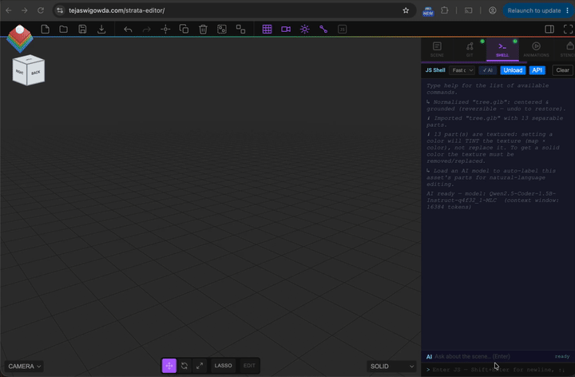

# Strata: A CSS-like language for 3D scenes



**A deterministic, human-readable selector language for editing and versioning 3D scenes. Sovereign, browser-native, no build. Optional AI that stays within bounds.**

**The language is the workhorse.** Strata puts a small, familiar interface over a 3D scene: address parts with CSS-like selectors, change them with a closed set of command-backed ops, and version the result with git. The interface is deterministic and works entirely **by hand, without any AI**. It is the primary product. Every mutation is undoable, git-tracked, and human-readable.

**AI is a slim optional front door.** Because the language is small and explicit, a stock on-device model can map natural language onto it. No task-specific training is needed. It is the natural-language layer *over* the deterministic interface, not the foundation. It debuts most vividly at **animation**: "make it bounce" becomes a real keyframe clip. Generation (blocking out a scene from a prompt) is kept as **scaffolding**, not the headline.

**Production ships validated AI only.** Development mode (`DEV=1`) exposes all models for research. Production mode (default) shows only models that have passed the edit eval matrix. This confirms the zero-training claim.

> **The thesis (short).** 3D editing decomposes into a deterministic shell (selector language + ops + undo/git) plus **5 optional fuzzy tasks** (op-selection, selector-resolution, argument-extraction, labeling, multi-op decomposition). A stock on-device model suffices for those tasks, with no task-specific training.

**Sovereign by default.** Nothing leaves the device except by your explicit action (git sync, `fetchAPI`). Inference is local. Scene state stays on-device.

---

## Quick start

```bash
npx serve docs       # local dev. Or point GitHub Pages at docs/
```

Requires **Chrome 113+** (WebGPU). Verify at [webgpureport.org](https://webgpureport.org).

**With external AI models (Ollama, OpenAI, Claude):**

```bash
# Terminal 1: start the server with dev mode enabled
export ANTHROPIC_API_KEY="sk-ant-..."  # or OPENAI_API_KEY
DEV=1 node server.js

# Terminal 2: open http://127.0.0.1:5500 in Chrome
# External models now appear in the model dropdown
```

---

## Documentation

This README is the landing page and the thesis. The reference material is split into focused guides:

| Guide | What's inside |
|-------|---------------|
| [**The language**](guides/LANGUAGE.md) | Selector grammar, name normalization, the closed op set, the `$S()` query/traversal API, class & id authoring, lasso, and host-enforced guards. |
| [**Animation**](guides/ANIMATION.md) | The scene-wide universal timeline: absolute-time tracks, `.then`/`.with`/`.at` sugar, entrance/exit/attention recipes, lifecycle. |
| [**Scene intelligence**](guides/SCENE_INTELLIGENCE.md) | Descriptor-derived classes, symmetry pairs, texture-color naming, and `findByDescription` — no vision model. |
| [**JS Shell**](guides/JS_SHELL.md) | The primary editing surface: Monaco integration, core globals, object lookup, spatial helpers, modeling ops, Edit Mode, and `fetchAPI`. |
| [**Optional AI acceleration**](guides/AI_GUIDE.md) | The agentic loop, AI scene context, model configuration (WebLLM / external / client-side), cost tracking, and the generation eval. |
| [**Architecture**](guides/ARCHITECTURE.md) | Two-form scene representation (git-diffable round-trip) and the full module map. |
| [**Git versioning**](guides/GIT_VERSIONING.md) | Repository sync, the merge-conflict viewport, and access-token scope. |
| [**Roadmap**](guides/ROADMAP.md) | Done / next / then. |
| [**Dev Mode API**](guides/DEV_MODE_API.md) | Server-side external-model proxy and its security model. |
| Mesh editing | [Quick start](guides/MESH_EDITING_QUICK_START.md) · [Guide](guides/MESH_EDITING_GUIDE.md) · [Technical](guides/MESH_EDITING_TECHNICAL.md) · [Status](guides/IMPLEMENTATION_STATUS.md) |

---

## The workhorse: a deterministic language

3D editing splits into a deterministic shell (the language) and optional fuzzy layers (AI). The shell is host code: selector matching, command execution, undo, versioning, normalization, guards. **The language is sufficient for manual editing and is the primary interface.** The full reference is in [LANGUAGE.md](guides/LANGUAGE.md).

**Optional AI layer (fuzzy tasks).** When using AI, it handles **5 bounded tasks**: op-type selection, selector resolution, argument extraction, labeling, and multi-op decomposition. These tasks are **optional**—you can edit entirely by hand. When AI is used, it stays within bounds: it emits a selector plus an op. The host enforces correctness. See [the AI guide](guides/AI_GUIDE.md).

**Manual editing:** Select and edit by hand. Chain commands. Version with git. Undo any change.

```js
$S('.rims').recolor('#111')         // by hand: recolor 4 wheels
$S('.wheel.front').spin('y', 1, 2)  // by hand: compound selector + animation
$S('#dump-bed').scale(1.2)          // by hand: edit a labelled part
op({ type:'recolor', selector:'.rims', color:'red' })   // explicit op-JSON (same thing)
ops([ {}, {} ])                     // several ops in one undoable batch
```

**With optional AI:** Say what you want. The model translates to the selector language. The shell executes.

```js
// Type in the AI input:
// "make the wheels black"
// → AI emits: $S('.rims').recolor('#111')
// → shell executes, scene updates, git records
```

Everything else is deterministic. If a feature seems to need the model to reason more, the fix is to decompose it, not to expand the model's job.

**CSS-via-JS.** The language borrows CSS's selecting-and-value grammar. A selector, an op (the property), a value, plus chained transforms. It is emitted as JS/JSON and executed on the one surface.

```
Author and label the scene   ->  the "HTML" (structure: parts, labels, hierarchy)
Style and animate by selector ->  the "CSS"  (recolor, scale, spin by selector)
Behavior and runtime          ->  handed off to engines (out of scope)
```

---

## Features

| | |
|---|---|
| **Selector-based language** | Address imported parts by CSS-like selector (`$S('.wheel.front')`). Edit them with a closed set of command-backed, guarded ops (`recolor`, `scale`, `spin`). Resolution is deterministic. See [LANGUAGE.md](guides/LANGUAGE.md). |
| **One execution surface** | **All** code (manual, AI-generated, eval fixtures) runs through a single `execute()` binding. Monaco editors present AI-generated code with live syntax highlighting; the Run button executes only the edited code. Same undo stack, same error handling, no second path. The editor is disposed immediately after execution. |
| **Everything reversible** | Every mutation goes through `editor.execute(new Command())`. Selectors, ops, labels, and class edits are all undoable. |
| **Git versioning** | Auto-load on open, commit, and a split-screen merge-conflict viewport. The AI (when used) writes diff-aware commit messages. Scenes are diffable JSON. See [GIT_VERSIONING.md](guides/GIT_VERSIONING.md). |
| **JS Shell** | Manual or AI-driven JavaScript REPL. Type queries, edit manually, or ask the AI. Every command is undoable and versioned. See [JS_SHELL.md](guides/JS_SHELL.md). |
| **Sovereign by default** | On-device inference via WebGPU (WebLLM / MLC). Nothing leaves the device except your explicit git sync or `fetchAPI` call. |
| **Universal timeline** | A scene-wide Animations tab: one absolute clock, tracks addressed by selector (objects + camera), events versioned in the scene JSON and exported to glTF. The AI authors events too, via deterministic recipes (`spin`, `bounce`, `pulse`). See [ANIMATION.md](guides/ANIMATION.md). |
| **Scene intelligence** | Resolve descriptive part references on imported GLBs with meaningless node names. Geometry, color, and symmetry descriptors become auto-classes. No vision model. See [SCENE_INTELLIGENCE.md](guides/SCENE_INTELLIGENCE.md). |
| **Optional AI assist** | Natural-language interface over the deterministic shell. Bounded 5-task decomposition. Self-correcting agentic loop. Production ships only validated models. See [AI_GUIDE.md](guides/AI_GUIDE.md). |
| **Verify UX (on import)** | After labeling, a panel surfaces the semantic guesses. Symmetric parts collapse to one decision ("Wheel x4"). Low-confidence guesses come first. |
| **Modeling ops** | Boolean CSG, mirror, array, subdivision. Undoable and callable by hand or AI. The manual-editing layer. |
| **Lasso selection** | Freehand-drag a viewport region to multi-select every mesh inside it (occlusion-aware, resolution-independent). Exposed to the shell as `lasso([[x,y],…])` and the first-class pseudo-selectors `$S(':lasso')` / `$S(':selected')`, so the same selection works by hand or in code. |
| **Class & id authoring** | jQuery-style `$S(sel).addClass()`, `.removeClass()`, `.toggleClass()`, `.editID()` retag the addressable vocabulary set-wide in one undo; `.id()` / `.isClass()` read it back. Names normalize, so hand-typed and auto-derived tokens always reconcile. |
| **Edit Mode** | Half-edge mesh editing: vertex, edge, and face selection, extrude, inset, bevel, delete, weld, UV projection. |
| **No build step** | Serve `docs/` as-is. Plain ES modules, importmap, no bundler. |
| **Generation (scaffolding)** | The model can (optionally) block out structure from a prompt. This is the weaker, ceded task. It is kept as scaffolding, not the headline. |

---

## Where Strata sits

Strata is the **authoring layer upstream of the ecosystem**. It is the place you *iterate*, not the place you ship. You build and edit fast: AI plus WebGL, no render wait, every step versioned. Then you **hand off** the result to any renderer or engine.

- **Author here.** Structure (scene graph) + design (selectors / ops, labels, keyframe clips), versioned in git.
- **Hand off via glTF + labels.** Export to any renderer (Blender / Unreal / WebGPU → media) or any engine (three.js / Unity / Unreal → runtime), where **behavior attaches to the labels**.
- Renderer- and engine-agnostic by design: Strata owns authoring; the downstream owns runtime and final pixels.

**Handoff status (honest).** glTF export with animations works today (`Sidebar, Export, GLB/GLTF`). Full label-through-`extras` survival and the broader renderer-agnostic pipeline are **partial / roadmap**: string `userData.label`s ride along on the default `userData → extras` path, but auto-classes (stored as Sets) do not yet serialize, and the handoff is not yet tested end-to-end.

**Three invariants (why Strata stays the authoring layer):** no runtime · no interaction · no render-wait-during-iteration. The moment a task needs one of those, it belongs downstream.

**Who it's for.** People who use engines and renderers but find them *in the way* during fast iteration. Strata is the authoring layer that comes **before** the handoff.

---

## The eval matrix: the editing gate

This is the most important evidence note in this README. **The matrix ran, and it set the production model size.**

The validation for the editing pivot is an eval matrix: per-task, per-model-size, per-scaffolding condition, plus a cloud-model ceiling. It ran across four Qwen sizes (0.5B / 1.5B / 3B / 7B, `q4f32_1`) plus Claude Haiku and Opus ceilings, **bare vs. scaffolded**, with resolved-correct-node scoring. Run it yourself from the [JS Shell](guides/JS_SHELL.md) with:

```js
await evalEditMatrix('scaffolded')   // then 'bare'. Load each model size, add Haiku/Opus for the ceiling
```

`evalEditMatrix` scores each of the 5 tasks independently from one generated edit. Selector resolution is scored as resolved-correct-node: the right nodes changed, and only those. The harness uses synthetic assets and is non-destructive (it snapshots and restores your scene).

**Results (scaffolded, `q4f32_1`, resolved-correct-node scoring):**

| task | 0.5B | 1.5B | 3B | Haiku | Opus |
|------|------|------|-----|-------|------|
| op-selection | 8% | **77%** | 69% | 85% | 92% |
| selector-resolution | 8% | 54% | 38% | 46% | 77% |
| arg-extraction | 46% | **92%** | 85% | 85% | 92% |
| labeling | 33% | 67% | 78% | 100% | 89% |
| multi-op | 0% | **75%** | 25% | 75% | 100% |
| **overall (scaffolded)** | 19% | **73%** | 59% | 78% | 90% |
| overall (bare) | 12% | 60% | 46% | 26% | 45% |
| scaffolding delta | +7 | +13 | +13 | +52 | +45 |

**What the matrix found:**

1. **The thesis holds — scaffolding helps at every scale, dramatically at the frontier.** Overall scaffolding delta is Haiku **+52**, Opus **+45**; small models **+7 to +13**. The honest framing: scaffolding *unlocks* capable models (they are convention-limited bare, and the selector-injection + constrained decoding lifts them into the language), and helps small models *modestly* (they are capacity-limited). This is **not** "tiny models match big ones" — it is "scaffolding unlocks capable models; it helps small ones modestly."

2. **1.5B is the viable floor.** Scaffolded overall **73%**, op-selection **77%**, arg-extraction **92%** (ties the Opus ceiling), multi-op **75%**, selector-resolution **54%**. A stock 1.5B with **zero training** drives the language well enough to ship. This sets the production model size.

3. **0.5B is under-capacity.** op-selection 8%, selector-resolution 8%, multi-op 0%. It reverts to writing full three.js boilerplate instead of narrow ops — a capability floor, not a steering bug. It is below the floor for editing. (It may still suffice for labeling-only: 33% scaffolded — a separate, narrower task.)

4. **Selector-resolution is the confirmed hard task.** Even Opus caps at **77%**, and scaffolding adds **nothing** on small models (+0 for 0.5B / 1.5B / 3B). It is capability-bound, not convention-bound. This is the architectural target for **host-side resolution** (pick-don't-compose, clarify-on-ambiguity, don't-over-enumerate) — [the next lever](guides/ROADMAP.md).

5. **Arg-extraction caps ~92%** at both ceilings — the achievable target. The scorer is a strict canonical-key match, so ~92% is "as good as it gets," which also confirms the scorer is calibrated.

**Honest footnotes (the never-silently-wrong discipline applies to our own numbers too):**

- **A 1.5B ≥ 3B inversion persists** on multi-op (75 vs 25) and op-selection (77 vs 69). Reported, not hidden: partly a small multi-op sample (n=4 this run), and partly that `Qwen2.5-Coder-1.5B` is unusually well-optimized in the WebLLM stack. Not over-claimed — the 1.5B floor claim rests on its *overall* profile, not this inversion.
- **Scorer fixes made the numbers trustworthy.** Synonym-tolerant multi-op scoring, resolved-correct-node selector scoring (not string match), and parser recovery of non-canonical-but-valid edits. The harness caught its own bugs; every number above is post-fix.

**The ship decision it drives.** Production ships **1.5B and up** (the [vetted list](guides/AI_GUIDE.md#browser-based-models-webllm)); **0.5B is excluded** as under-capacity. This is exactly the "validated models only" gate the top of this README describes — the production dropdown shows only what the matrix passed.

**Live spot-checks (illustrative, not the matrix).** Manual runs of "make the leaves red" on a labeled tree GLB match the matrix story end to end: both Claude Haiku 4.5 (cloud) and the **1.5B on-device model** emit the op surface (`$S('.leaves').recolor('#ff0000')`) with the correct narrow selector, not raw three.js and not the whole asset. The 1.5B occasionally wraps the op in a function it forgets to invoke (a format slip our few-shots' IIFE style invites), which the observe-and-retry loop catches.

The older generation-scaffolding eval (`evalAI()`) is documented in [the AI guide](guides/AI_GUIDE.md#the-generation-eval-legacy-axis-evalai).

---

## Design principles

These state the thesis. The language is primary; AI is optional.

- **Language is the workhorse.** The shell is the primary interface: selector matching, command execution, undo, versioning, normalization, guards. It is fully functional without AI. Manual editing is first-class.
- **AI stays in bounds (optional fuzzy core).** When AI is used, it handles 5 bounded tasks: op-type selection, selector resolution, argument extraction, labeling, multi-op decomposition. The AI emits a selector plus an op—the contract is explicit. Everything else is deterministic. If a feature seems to need more model reasoning, decompose it.
- **Model expresses intent. Host enforces correctness.** The model emits a selector plus an op. Guards (clone-on-write, texture-tint, merged-mesh, ground/clamp, subset-sanity) and arg-normalization ("black" to `#111`) are host-side. The model never has to remember them.
- **Resolution is deterministic.** Selectors match over verified labels and auto-classes. The model only translates fuzzy language to a selector. Once labeled, resolution needs no model.
- **One execution surface.** Manual and AI code run through the same `execute()` binding.
- **Sovereign by default.** Inference is on-device. Nothing leaves except by explicit user action (git, `fetchAPI`).
- **No new model.** Scene intelligence uses deterministic math, the renderer, and the already-loaded code LLM only.
- **No build step.** Plain ES modules. No bundler.
- **Everything reversible.** All mutations go through `editor.execute(new Command())`.
- **Validate by shape, not by flag.** three.js objects are checked by shape (tracks plus duration), never by an `isX` flag it may omit.
- **Never silently wrong.** Lossy codegen, ambiguous resolution, and merged-mesh GLBs are flagged, not guessed. Implemented is not the same as validated, and this README says which is which.

---

## Prior art

Selector-over-scene-graph exists (three-query-selector, scene.querySelectorAll, Unity-Scene-Query). NL grounding over 3D scene graphs exists (Cypher-for-3DSG, BBQ, FreeQ-Graph). Strata's synthesis is the new part: descriptor-derived classes, user-verified labels, selectors as the editing and versioning substrate, manual-first design, and a bounded optional AI layer. This is positioned as an extension, not an invention.

---

## Roadmap (at a glance)

- **Done.** The deterministic language (selectors + ops + guards), the `$S()` read/write API, the universal timeline, git versioning, scene intelligence, constrained decoding, and the **eval matrix run** (1.5B is the validated floor).
- **Next.** Host-side selector resolution (the confirmed hard task), and extracting `$S` as a standalone "jQuery for 3D" library + language spec.
- **Then.** Renderer-agnostic export pipeline, capture-pipeline integration, and a sovereignty dashboard.

The full list is in [ROADMAP.md](guides/ROADMAP.md).
