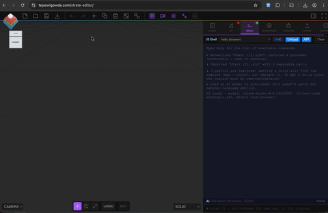

# Strata: A CSS-like language for 3D scenes



**A deterministic, human-readable selector language for editing and versioning 3D scenes. Sovereign, browser-native, no build. Optional AI that stays within bounds.**

**The language is the workhorse.** Strata puts a small, familiar interface over a 3D scene: address parts with CSS-like selectors, change them with a closed set of command-backed ops, and version the result with git. The interface is deterministic and works entirely **by hand, without any AI**. It is the primary product. Every mutation is undoable, git-tracked, and human-readable.

**AI is a slim optional front door.** Because the language is small and explicit, a stock on-device model can map natural language onto it. No task-specific training is needed. The layer is **model-agnostic: bring your own AI**. Run a stock model on-device (WebGPU / WebLLM), or connect any external API (Ollama, OpenAI, Claude) through `fetchAPI`. The same scaffolding, harness, and constrained decoding wrap every model, so they lift both local small models and frontier APIs onto the language. It is the natural-language layer *over* the deterministic interface, not the foundation. It debuts most vividly at **animation**: "make it bounce" becomes a real keyframe clip. Generation (blocking out a scene from a prompt) is kept as **scaffolding**, not the headline.

**Production ships validated AI only.** Development mode (`DEV=1`) exposes all models for research. Production mode (default) shows only models that have passed the edit eval matrix. This confirms the zero-training claim.

> **The thesis.** 3D editing = deterministic shell (selector language + ops) + optional model for the genuinely fuzzy residue: **argument-extraction, labeling, and ambiguous op-selection/segmentation**. Selector-resolution and op-selection (unambiguous verbs) are capability-bound tasks that run host-side instead — parity by construction, confirmed at 22/22 fixture-level agreement between a 1.5B and a frontier model. The shell is the standalone [3DOM library](https://github.com/tejaswigowda/3dom) ("jQuery for 3D"); Strata consumes it via host adapter. **Separation:** 3DOM = durable library; Strata = one consumer. On-device model suffices, zero training.

**Sovereign by default.** Nothing leaves the device except by your explicit action (git sync, `fetchAPI`). Inference is local. Scene state stays on-device.

---

## Quick start

```bash
npx serve docs       # local dev. Or go to: https://tejaswigowda.com/strata-editor/
```

or

```bash
node server.js
```

Requires **Chrome 113+** (WebGPU). Verify at [webgpureport.org](https://webgpureport.org).

**With external AI models (Ollama, OpenAI, Claude):**

```bash
# Terminal 1: start the server with dev mode enabled
export ANTHROPIC_API_KEY="sk-ant-..."  # or OPENAI_API_KEY
DEV=1 node server.js

# Terminal 2: open http://127.0.0.1:5500 in Chrome
# External models now appear in the model dropdown
```

---

## Documentation

This README is the landing page and the thesis. The reference material is split into focused guides:

| Guide | What's inside |
|-------|---------------|
| [**The language**](guides/LANGUAGE.md) | Selector grammar, name normalization, the closed op set, the `$S()` query/traversal API, class & id authoring, lasso, and host-enforced guards. |
| [**`$S` / 3DOM library**](https://github.com/tejaswigowda/3dom) | The standalone "jQuery for 3D" extraction: selectors + auto-labelling + op-chaining over any three.js scene, three as a peer dependency, and its own undo. Versioned surface in [SPEC.md](https://github.com/tejaswigowda/3dom/blob/main/SPEC.md). Now its own package/repo: `@tejaswigowda/3dom` (https://github.com/tejaswigowda/3dom), consumed here from a pinned CDN build. Docs: http://tejaswigowda.com/3dom/, [live demo](http://tejaswigowda.com/3dom/examples/bare.html). |
| [**Animation**](guides/ANIMATION.md) | The scene-wide universal timeline: absolute-time tracks, `.then`/`.with`/`.at` sugar, entrance/exit/attention recipes, lifecycle. The Render tab exports the timeline as video through a single camera or a multi-shot camera sequence with cut/fade transitions. |
| [**Scene intelligence**](guides/SCENE_INTELLIGENCE.md) | Descriptor-derived classes, symmetry pairs, texture-color naming, and `findByDescription`. No vision model. |
| [**JS Shell**](guides/JS_SHELL.md) | The primary editing surface: Monaco integration, core globals, object lookup, spatial helpers, modeling ops, Edit Mode, and `fetchAPI`. |
| [**Optional AI acceleration**](guides/AI_GUIDE.md) | The agentic loop, AI scene context, model configuration (WebLLM / external / client-side), cost tracking, and the generation eval. |
| [**Architecture**](guides/ARCHITECTURE.md) | Two-form scene representation (git-diffable round-trip) and the full module map. |
| [**Git versioning**](guides/GIT_VERSIONING.md) | Repository sync, the merge-conflict viewport, and access-token scope. |
| [**Roadmap**](guides/ROADMAP.md) | Done / next / then. |
| [**Dev Mode API**](guides/DEV_MODE_API.md) | Server-side external-model proxy and its security model. |
| Mesh editing | [Quick start](guides/MESH_EDITING_QUICK_START.md) · [Guide](guides/MESH_EDITING_GUIDE.md) · [Technical](guides/MESH_EDITING_TECHNICAL.md) · [Status](guides/IMPLEMENTATION_STATUS.md) |

---

## The two-way gate (host ↔ model)

The language is the primary interface. You edit by hand or with AI — same surface, one execution stack.

**By hand:**
```js
$S('.rims').recolor('#111')         // selector + op → execute
$S('.wheel.front').spin('y', 1, 2)  // compound selector + animation
op({ type:'recolor', selector:'.rims', color:'red' })   // explicit op-JSON
```

**With optional AI:** The host (deterministic) and model (user-chosen) form a gate.

```js
// "make the wheels black"
// → Host resolves ".wheels", validates
// → Model fills op-JSON (if needed)
// → execute, scene updates, git records
```

**Task split:** The eval showed selector-resolution caps at 77% even at Opus (capability-bound). It moved to the host — and so did op-selection, once the eval showed the SAME closed-set pattern for verbs ("paint"/"make it red" is always `recolor`, never a fuzzy call). The design: **decompose, don't expand the model's job.**

| Task | Handler | Why |
|------|---------|-----|
| **Selector resolution** | **HOST** (deterministic) | Resolved from request TEXT alone — the model is never asked for a selector, only shown the resolved target as fixed context. Model-independent by construction: **22/22** fixture-level agreement between Haiku and the 1.5B. When genuinely ambiguous, host clarifies (pick-don't-compose). |
| **Op-selection — unambiguous verbs** | **HOST** (deterministic) | Verb→op is a closed mapping (paint/color → `recolor`, spin/turn → `rotate`, lift/move → `move`, ...), assigned host-side and dropped from the model's schema. Same parity: **22/22** agreement. |
| **Multi-op segmentation** | **HOST** (deterministic), residual ambiguity on the model | Host decides how many ops to emit and their order. **11/13** fixture agreement — 2 fixtures carry genuine segmentation ambiguity neither model resolves consistently. |
| **Argument extraction** | **MODEL** | Fill in the values: the color for `recolor`, the scale factor for `scale`. Host normalizes/clamps (incl. collapsing a color-only `setMaterial` into `recolor`). **22/22** agreement — the values differ by request, not by which model is running. |
| **Op-selection — ambiguous verbs** | **MODEL** | "make it pop", "fix the front" — no deterministic verb mapping; the model picks from the constrained enum. |
| **Labeling** | **MODEL** | Pure generation: name an unlabeled shape. The one genuinely model-bound task — frontier leads (100% vs 67% at 1.5B); the only place capability shows. |

The host enforces: clone-on-write (shared materials), normalization ("black" → `#111`), texture-tint warnings, merged-mesh graceful-fail, subset-sanity flags, color-only-`setMaterial`→`recolor` canonicalization. The model fills in whatever the host doesn't resolve — values always, selector/op-type only on genuine ambiguity — and the host validates. See [AI guide](guides/AI_GUIDE.md).

---

## Features

| | |
|---|---|
| **Selector-based language** | Address parts by CSS-like selector (`$S('.wheel.front')`). Edit with guarded ops: `recolor`, `scale`, `spin`, etc. Deterministic resolution. See [LANGUAGE.md](guides/LANGUAGE.md). |
| **Git versioning** | Auto-load, commit, split-screen merge-conflict resolution. AI writes diff-aware messages. Diffable JSON. See [GIT_VERSIONING.md](guides/GIT_VERSIONING.md). |
| **JS Shell** | REPL: type queries, edit manually, or ask AI. Every command undoable and versioned. See [JS_SHELL.md](guides/JS_SHELL.md). |
| **Sovereign by default** | On-device inference (WebGPU/WebLLM). Nothing leaves the device except by your explicit action (git, `fetchAPI`). |
| **Universal timeline** | Scene-wide absolute clock. Tracks addressed by selector (objects + camera). Events versioned in JSON and glTF. AI authors via deterministic recipes. See [ANIMATION.md](guides/ANIMATION.md). |
| **Video render** | Render tab: export the universal timeline as video (mp4/webm, up to 1080p, 24/30/60 fps) through any camera — or a **camera sequence**: draggable shot blocks with cut/crossfade transitions, versioned with the scene. Progress bar, live preview, one-click download. |
| **Scene intelligence** | Geometry/color/symmetry descriptors → auto-classes (no vision model). Resolve descriptive references on imported GLBs. See [SCENE_INTELLIGENCE.md](guides/SCENE_INTELLIGENCE.md). |
| **Optional AI** | Natural language → selector + op. Model-agnostic (WebLLM, Ollama, OpenAI, Claude). Bounded 5-task decomposition. Self-correcting loop. Production ships validated models. See [AI_GUIDE.md](guides/AI_GUIDE.md). |
| **Modeling ops** | Boolean CSG, mirror, array, subdivide. Undoable, command-backed. |
| **Lasso & selection** | Freehand draw to select. Interactive or programmatic: `lasso([[x,y],…]).recolor('#f00')`. First-class pseudo-selectors `$S(':lasso')` / `$S(':selected')`. |
| **Class & id authoring** | jQuery-style: `.addClass()`, `.removeClass()`, `.editID()`. Names normalize; auto-derived and hand-typed tokens always match. |
| **Edit Mode** | Half-edge mesh editing: vertex/edge/face select, extrude, inset, bevel, delete, weld, UV. |

---

## Where Strata sits

**The authoring layer.** Build fast (AI + WebGL, no render wait), iterate with full undo/git, hand off to any renderer or engine.

- **Author here:** Structure + design (selectors / ops, labels, clips), versioned in git.
- **Hand off via glTF + labels** to any renderer (Blender / Unreal / media) or engine (three.js / Unity / runtime), where behavior attaches to the labels.

**Why the boundary matters:** No runtime, no interaction, no render-wait-during-iteration. Once a task needs one of those, it belongs downstream.

**Export status (honest):** glTF with animations works today, and the Render tab exports the timeline as video (mp4/webm) directly in-editor — including multi-camera shot sequences with transitions. Label strings ride along on `userData → extras`. Auto-classes don't yet serialize; end-to-end handoff is partial/roadmap.

---

## The eval matrix: the editing gate

**The matrix ran, and it set the production model size.** Per-task, per-model-size, per-scaffolding, with resolved-correct-node scoring. 0.5B / 1.5B / 3B / 7B Qwen, plus Haiku/Opus ceilings. Run it yourself:

```js
await evalEditMatrix('scaffolded')   // then 'bare'
```

**Results (scaffolded — the pre-decomposition baseline, before host resolution existed):**

| task | 0.5B | 1.5B | 3B | Haiku | Opus |
|------|------|------|-----|-------|------|
| op-selection | 8% | **77%** | 69% | 85% | 92% |
| selector-resolution | 8% | 54% | 38% | 46% | 77% |
| arg-extraction | 46% | **92%** | 85% | 85% | 92% |
| labeling | 33% | 67% | 78% | 100% | 89% |
| multi-op | 0% | **75%** | 25% | 75% | 100% |
| **overall** | 19% | **73%** | 59% | 78% | 90% |

**Host-resolved, final clean result (run 20, both models, instrumented).** Moving selector-resolution AND unambiguous op-selection to the host doesn't change either model's architecture — it changes which **tasks need a model at all**. On the resulting mechanical tasks the two models are **interchangeable**: they agree on every fixture, because the host resolves the target and the verb before the model is ever consulted for them.

| task | Haiku | 1.5B | fixture-level agreement | mechanism |
|------|-------|------|--------------------------|-----------|
| op-selection | 86% | 86% | **22/22** | host assigns unambiguous verbs; model only for ambiguous ones |
| selector-resolution | 91% | 91% | **22/22** | host resolves from request text; model never sees a selector |
| arg-extraction | 91% | 91% | **22/22** | model fills values; host normalizes/clamps |
| multi-op | 77% | 77% | 11/13 | host segments; 2 fixtures carry genuine ambiguity (see below) |
| labeling | 100% | 67% | 6/9 | pure generation — the one model-bound task |
| **overall** | **89%** | **85%** | | |

**Parity by construction.** On the three fully-decomposed tasks — selector-resolution, op-selection (unambiguous verbs), arg-extraction — Haiku and the 1.5B agree on **every fixture (22/22)**. This isn't a measured coincidence, it's a structural guarantee: the host resolves the selector from request text and assigns the op for unambiguous verbs *before* the model is asked anything, so the model's identity cannot change the outcome. The model's remaining job — filling argument values — differs by REQUEST, not by which model is running it.

**Where the two models still disagree — the honest edge, exactly where the thesis predicts it:**
- **Labeling (3 of 9 fixtures).** Pure generation: naming an unlabeled shape from its descriptors. The one genuinely model-bound task, and the frontier leads (100% vs 67%). Correct and expected — labeling isn't decomposable into lookup, so capability should (and does) show here.
- **Multi-op (2 of 13 fixtures — `everything-red`, `wheels-and-rims`).** The models SPLIT: each gets one of the two right and the other wrong. Residual segmentation ambiguity, not a systematic gap — neither model is "better" at it.

Everything mechanical is parity-by-construction; the only disagreements are the one genuinely model-bound task and two genuinely ambiguous fixtures.

**The overall 89 vs 85 gap is almost entirely labeling.** Strip labeling out and the two models are near-identical. Sufficiency, not parity, precisely located: the 1.5B is sufficient because the mechanical tasks left the model entirely; it trails only on the generative residue — exactly where a frontier model should lead.

**The honest multi-op tradeoff.** Multi-op is 77/77 — down from an earlier 85 (1.5B, pre-op-assist). Reported as a real cost, not hidden: making resolution genuinely host-side removed the model's selector as a fallback, and that fallback had been papering over real segmentation ambiguity on 2 fixtures. The number now reflects the true difficulty instead of being propped up by a lucky model guess — never-silently-wrong applied to the eval's own result.

**Dose-response, reframed.** Where a task is decomposed (selector-resolution, op-selection, arg-extraction, mostly multi-op), the model-size curve is FLAT by construction — not because small models got good, but because no model resolves them at all. Where a task is NOT decomposable (labeling), capability shows in full, sloped: 0.5B 33% / 1.5B 67% / Haiku 100%. (Op-selection and multi-op weren't re-run at 0.5B under the current host-assist mechanism, so those cells aren't restated here rather than asserting numbers never measured under this code path.)

**The clearest flat-line evidence: a 0.5B that scored 8% on selector-resolution scaffolded (reverted to boilerplate — under-capacity) reaches 91% host-resolved — identical to the 1.5B and to Haiku.** That is the decompose-don't-expand principle made concrete: task performance stops depending on model size once the hard part moves off the model.

**Quantization:** q4f16 (~1GB) == q4f32 (~1.9GB) byte-identical on all 88 fixtures. Host-side decomposition made the system quantization-insensitive too; model properties stop mattering once the task is off the model.

**Ship decision:** Production shows 1.5B+ only; 0.5B excluded (under-capacity scaffolded, redundant host-resolved). Host-resolution is production-ready on the current model lineup, now confirmed at 22/22 fixture-level parity on every mechanical task. The eval demonstrated it; the gate proves it.

---

## Design principles

- **Sovereignty is a property, not a mode.** On-device by default (WebLLM). User picks the model: local ~1GB 1.5B (sovereign) or API (their key). Never silently escalates. Sovereignty falls out of the architecture.
- **Language is the workhorse. AI is optional.** Manual editing is first-class. You can edit entirely by hand. The model is not the subject.
- **Model-agnostic.** Wrap any model (WebLLM, Ollama, OpenAI, Claude) in the same scaffolding. Both local small models and frontier APIs lift from the same architecture.
- **Decompose, don't expand.** If a task caps out (selector-resolution at 77% even at Opus), move it host-side. Once decomposed, model capability becomes irrelevant.
- **One execution surface.** Manual code, AI code, eval fixtures all run through the same `execute()` binding and undo stack.
- **Never silently wrong.** Ambiguous resolution, lossy codegen, merged-mesh GLBs are flagged. Implemented ≠ validated. This README says which is which.
- **No build step.** Plain ES modules, importmap, three.js peer dependency. Serve and run.

---

## Prior art

Selector-over-graph exists (three-query-selector, querySelectorAll). NL-to-3D exists (Cypher, BBQ, FreeQ-Graph). Strata's synthesis: descriptor-derived classes, user-verified labels, selector editing + versioning, bounded optional AI. Integrated extension, not invention.

---

## Roadmap (at a glance)

- **Done.** Deterministic language (selectors + ops), `$S()` API, universal timeline (absolute + `.then`/`.with`/`.at`), git versioning, scene intelligence, constrained decoding, **eval matrix** (1.5B is viable floor), multi-op segmentation, bulk property ops, standalone [3DOM library](https://github.com/tejaswigowda/3dom) (Strata consumes via host adapter), host-side selector + op-type resolution (parity by construction, 22/22 fixture agreement, clean Haiku re-run).
- **Next.** Resolve the 2 residual multi-op segmentation-ambiguity fixtures. Alien-syntax ablation.
- **Then.** glTF label export, optional vision layer, renderer-agnostic pipeline, capture integration, sovereignty dashboard.

Full details in [ROADMAP.md](guides/ROADMAP.md).
